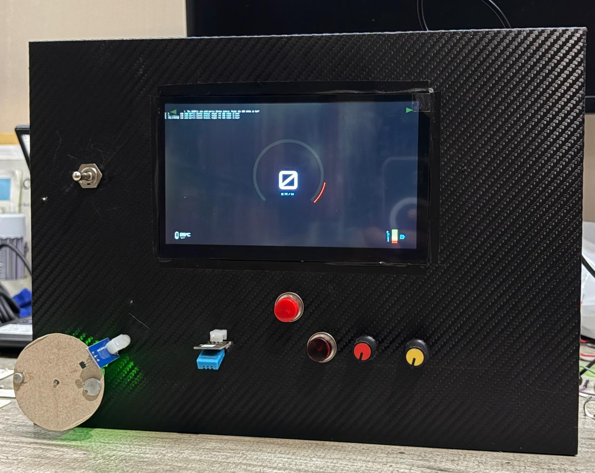
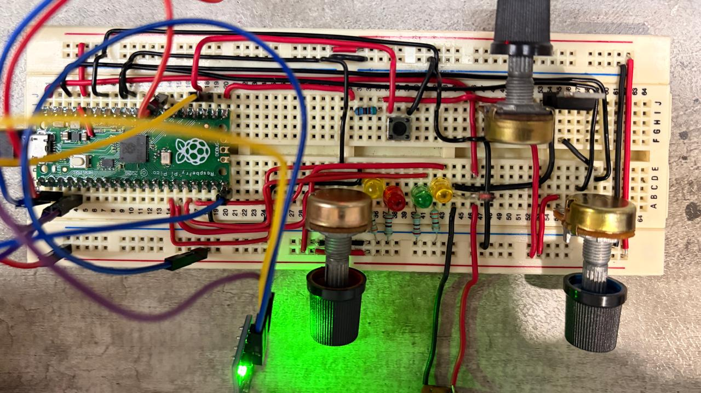
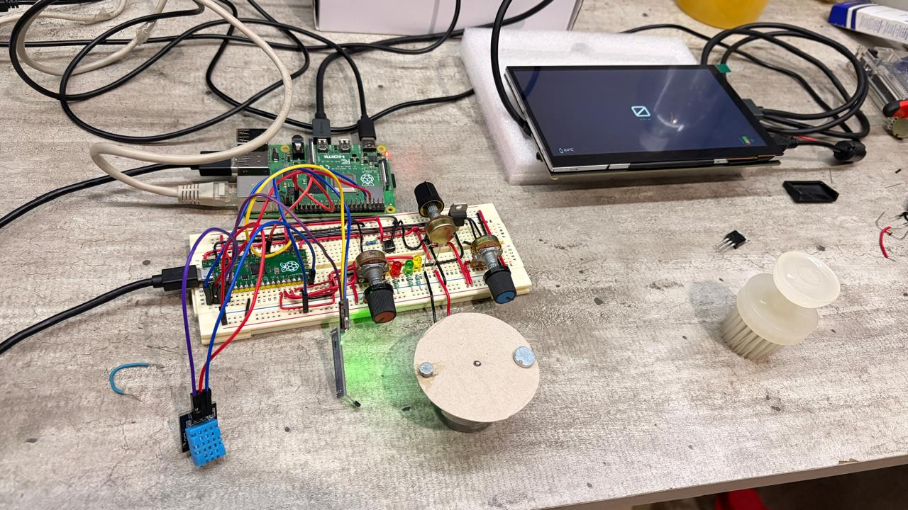

# 🏍️ Moto Dashboard IoT: Sistema de Telemetría de Alta Resolución
### **Desarrollado durante la carrera de Ingenieria en Tecnologias Automotrices en la Universidad Autónoma de Guadalajara (UAG)**



Este proyecto consiste en un cuadro de instrumentos digital de alto rendimiento para motocicletas, integrando hardware embebido de doble capa (**Raspberry Pi 4** y **Raspberry Pi Pico**) con una interfaz gráfica moderna desarrollada en **PySide6 (Qt)**. El sistema no solo visualiza datos, sino que incluye un simulador mecánico "Hardware-in-the-Loop" para validación de sensores.

---

## 🚀 Características Principales
* **Velocímetro de Alta Resolución:** Cálculo basado en tiempo entre pulsos (Delta-Time) para una precisión absoluta sin saltos de velocidad.
* **Interfaz Fluida (60 FPS):** Filtro matemático Low-Pass en MicroPython para una aguja con inercia realista.
* **Sistema de Iluminación Real:** Control digital de direccionales, luces altas/bajas e intermitentes (hazards) con prioridad de seguridad.
* **Silent Boot:** Configuración personalizada del kernel de Linux para un arranque limpio sin logs del sistema (OEM Style).
* **Simulador HIL Integrado:** Banco de pruebas con motor DC controlado por PWM para estresar el sensor Hall.

---

## ⚡ Demostración en Tiempo Real

*Visualización de la respuesta suave del tacómetro y velocímetro gracias al filtro de suavizado algorítmico.*

---

## 🛠️ Stack Tecnológico

| Componente | Tecnología | Función |
| :--- | :--- | :--- |
| **Cerebro Gráfico** | Raspberry Pi 4 Model B | Renderizado de UI y lógica de procesamiento de datos. |
| **Controlador de Telemetría** | Raspberry Pi Pico (RP2040) | Adquisición de datos en tiempo real y control de actuadores. |
| **Frontend** | PySide6 / QML | Interfaz gráfica vectorial con estilo "Orbitron". |
| **Backend** | Python 3.10 | Comunicación serial y manejo de señales. |
| **Firmware** | MicroPython | Lógica de interrupciones y filtrado de señales analógicas. |

---

## 🔌 Hardware Overview
El sistema utiliza una arquitectura distribuida para garantizar que el renderizado gráfico no interfiera con la lectura crítica de los sensores.



### Sensores e Inputs:
* **Sensor Hall:** Lectura de velocidad magnética.
* **Sensor DHT11:** Monitoreo de temperatura ambiente del motor.
* **ADC Potenciómetros:** Nivel de combustible y aceleración.
* **Switches Industriales:** Palanca de 3 posiciones para direccionales y botones de grado automotriz.

---

## 🧠 Decisiones de Ingeniería

### 1. Comunicación UART Optimizado (Zero Lag)
Para evitar el retraso visual, el backend en la Raspberry Pi 4 utiliza un algoritmo de **"Latest-Packet-Only"**. En lugar de procesar cada línea que llega, el buffer se limpia constantemente y solo se parsea la cadena de datos más reciente, eliminando cualquier delay acumulado.

### 2. Filtrado de Señal
En lugar de depender de hardware (capacitores) para limpiar el ruido del sensor de velocidad, se implementó un **filtro paso bajo (Low-Pass Filter)** por software. La velocidad objetivo es "perseguida" por la aguja virtual con un factor de suavizado de 0.1, logrando una transición visual orgánica.

---

## 📦 Instalación y Despliegue

### Configuración del Servicio (Mata-Zombies)
Para asegurar que el dashboard sea el único proceso gráfico y se reinicie automáticamente, se utiliza un servicio de `systemd`:

```ini
[Service]
ExecStartPre=-/usr/bin/killall python3
ExecStart=/home/ubuntu/dashboard-iot/venv/bin/python main.py
Restart=always
```

### Silent Boot (OEM Look)
Para eliminar el texto de arranque de Linux, modifica el archivo `/boot/firmware/cmdline.txt` agregando:
`quiet loglevel=0 vt.global_cursor_default=0 logo.nologo`

---

## 📸 Galería de Desarrollo

*Integración final de la pantalla de 7 pulgadas con el banco de pruebas de sensores.*

---

## 🎓 Créditos

* **Leonardo David Contreras Rebollo** - Estudiante de Ingeniería en Tecnologías Automotrices (UAG Zapopan, Jalisco).
* **Emilio Israel Diaz Infante Padilla** - Estudiante de Ingeniería en Tecnologías Automotrices (UAG Zapopan, Jalisco).
* **Juan Francisco Felix Escamilla** - Estudiante de Ingeniería en Tecnologías Automotrices (UAG Zapopan, Jalisco).
* **Gabriel Valle Carrasco** - Estudiante de Ingeniería en Tecnologías Automotrices (UAG Zapopan, Jalisco).
