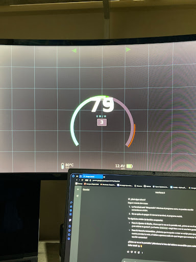

This document is for everything related to the communication details, Back-end to Front-end, Data flow, Signals and general design

V 1.2:

Separated the project into two main parts to make things easier:
- main.py: Handles all the backend stuff (processing data and later the serial communication with the Pico).
- dashboard.qml: Just for the visuals, colors, and animations.

Now we have two ways to run this: "Hardware mode" directly on the Pi, or "Local mode" on the PC just for designing the interface.

V 1.3:

- The UI layer (`dashboard.qml`) is now temporarily self-sufficient for visual testing. It has an internal dummy-data generator.
- `main.py` is currently stripped back to just act as a launcher for the QML engine. No serial data processing yet, focusing 100% on getting the frontend looking right.

V 1.4:

**Backend-Frontend Link Established:**
The architecture is now fully integrated. 
- `main.py` now hosts a `Backend` class that inherits from `QObject`.
- It uses Qt Signals (`@Signal`) and Slots to push data variables (Speed, RPM, Temp, Fuel, Lights) asynchronously to the QML engine.
- `dashboard.qml` uses a `Connections` block to catch these signals and trigger functions like `onSpeedChanged(val)` to update its internal properties.