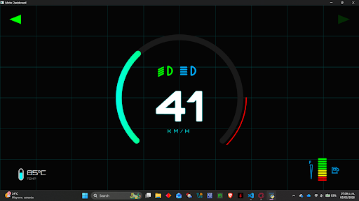

This document is about all the important decisions and why they were taken

## V 1.2:

- Decided to run the UI code locally on the PC. Pushing to the Raspberry Pi for every small color or pixel change in the QML was a pain and took way too long.
- Left an overlapping number bug on the speedometer for now. The main goal right now is just to get the general layout and shapes working. I'll fix the text issues later.

## V 1.3:

- Big visual upgrade: Moved away from simple text elements and implemented QML `Canvas` to draw a dynamic, color-changing arc for the RPMs and added shapes for battery and temp indicators. It looks way better for the bike.
- To test the animations without wiring up the Pico or writing complex Python logic yet, I added a mock data `Timer` directly inside the `dashboard.qml` file. This simulates the bike revving up and down so I can see the UI reacting in real-time.
- Fixed the overlapping text bug on the speedometer by cleaning up the QML layouts.

## V 1.4:

- **The Big Disconnect:** Turned off the mock data `Timer` inside the QML. The frontend is no longer faking the numbers.
- **Python Integration:** Established the real connection between the QML frontend and the Python backend using QML `Connections` targeting the `backend` context property. Now, Python pushes the data, and QML just listens and updates the UI.
- **UI Tweaks:** Added the high/low beam indicators with custom drawn shapes (4 rays instead of a generic icon) and implemented a 10-bar style fuel gauge instead of a boring percentage text. It looks much more "cyberpunk/racing" now.

## V 2.0

- **Decision:** Switch from Arduino to Raspberry Pi Pico using UART.
  **Context:** Arduino was okay for testing but the logic levels and I2C were giving me headaches.
  **Outcome:** The Pico is way better. It's faster and I can code it in MicroPython.
  
- **Decision:** Separate the sensor logic into its own file (`pico_main.py`).
  **Context:** I need to keep the code that runs on the Pico separate from the main dashboard code. 
  **Outcome:** Created a dedicated script for the Pico. It reads the raw data and spits it out via Serial. 

- **Decision:** Daemonize the Dashboard Process.
  **Context:** The dashboard would close if I disconnected my laptop.
  **Outcome:** Set up the systemd service to run as a background daemon. Now it's bulletproof.

## V2.1: Telemetry Synchronization & Data Filtering

* **UART Buffer Overflow Fix (The "Delay" Issue):** During the initial integration of the Pico and the Raspberry Pi 4, the dashboard experienced a severe visual delay. The UI would lag several seconds behind the physical actions. We diagnosed this as a buffer overflow: the Pico was transmitting data at ~100Hz (`utime.sleep(0.01)`), flooding the Pi's serial port faster than the PySide6 event loop could parse it. The fix was twofold: we throttled the Pico's transmission rate to a stable 20Hz and implemented a buffer flush (`serial_port.reset_input_buffer()`) on the Pi 4 to ensure it only reads the freshest telemetry packet, instantly eliminating the lag.
* **Software Low-Pass Filter for Speed:** The raw hardware interrupts from the Hall effect sensor were too sensitive, causing the speed readout on the dashboard to jitter erratically. Instead of adding a physical RC filter (capacitors/resistors) to the sensor wiring, we solved this entirely via software on the Pico. By storing the most recent speed pulses in a rolling array and calculating the average before sending it over UART, the QML interface now displays perfectly smooth and stable numbers.

## V2.2: UART Buffer Optimization & Boot Traceability

* **"Latest-Packet-Only" UART Parsing:** To completely eliminate UI rendering delays, we overhauled how the Raspberry Pi handles incoming serial data. Instead of processing incoming packets sequentially (which queues up stale data if the Pi's event loop stutters), the `main.py` backend now reads the entire contents of the serial buffer at once (`serial_port.read(in_waiting)`). It then splits the payload and explicitly extracts only the final index `[-1]`. This guarantees the QML dashboard always renders the absolute real-time state of the motorcycle, instantly discarding any micro-backlog of older telemetry.
* **Embedded Boot Sequence Logging:** Added a numbered verbose logging sequence during the application's startup phase. Since this dashboard runs headlessly on a motorcycle, tracing the exact step of failure (e.g., PySide6 initialization, Serial connection, or QML parsing) via systemd logs is critical for on-the-fly debugging without needing to plug in external peripherals.

## V2.3: Automated Sensor Validation

* **Mechanical Speed Simulation:** Manually spinning the magnet wheel was insufficient for stress-testing the software low-pass filter and the UART transmission rate at highway speeds. We decided to build a physical test bench using a high-speed DC motor to spin the magnet.
* **Logic vs. Power Isolation:** Instead of wiring a potentiometer directly in series with the DC motor (which would burn out the component due to high current draw), we used the Pico as a middleman. By reading a safe, low-voltage ADC signal and outputting a PWM signal to a transistor, we successfully separated the logic circuit from the power circuit, mirroring real-world automotive ECU design.

## V2.4: UI Sweep Validation Mode

* **Diagnostic Sweep Test:** To validate the QML graphical rendering (specifically the tachometer arc wrapping and text scaling) without relying on the physical Raspberry Pi Pico or the motor simulator, we overhauled the fallback simulation mode. Instead of generating random jittery values, the Python backend now executes a deterministic "sweep test," smoothly animating the speed from 0 to 320 km/h and back down. This allows UI/UX designers to test the full range of motion of the graphical components on any standard PC strictly through software.

## V2.5: Non-Blocking Logic & Silent Boot

* **Non-Blocking Blinker Logic:** To make the turn signals flash, we could not use a simple `utime.sleep()` command, as that would halt the entire script and pause the UART telemetry transmission, causing a massive lag on the dashboard. Instead, we implemented an asynchronous cycle counter (`ciclos_parpadeo`) within the main loop to toggle the LED states every 500ms without interrupting the data flow.
* **State Machine for Headlights:** We implemented a basic state machine with a software debounce for the headlight button. This allows a single push-button to cycle continuously through three states (`0: Off`, `1: Low Beam`, `2: High Beam`) cleanly.

## V2.5.1: High-Resolution Telemetry & Algorithmic Smoothing (Hotfix)

* **Time-Based Speed Calculation (Infinite Resolution):** The previous iteration calculated speed by counting Hall sensor pulses over a fixed 1-second window, which mathematically limited the resolution to 5 km/h steps and caused the dashboard UI to jump abruptly. We rewrote the logic to measure the exact time elapsed (delta time in milliseconds) between individual pulses. This provides an instantaneous frequency calculation with infinite decimal resolution.
* **Mathematical Low-Pass Filter:** To prevent the UI from snapping to 0 when braking hard or jumping erratically due to sensor noise, we implemented an algorithmic smoothing filter (`velocidad_suavizada += (velocidad_objetivo - velocidad_suavizada) * 0.1`). The transmitted speed now mathematically "chases" the target speed, mimicking the physical inertia of a real mechanical gauge.
* **Single-Thread Architecture Optimization:** We deprecated the `_thread` module previously used for the DHT11 temperature sensor. Multi-threading on the Pico's MicroPython environment introduced unnecessary overhead. We replaced it with a non-blocking `utime.ticks_diff()` check inside the main loop, streamlining the processor's workload and allowing the main UART loop to run flawlessly at 50ms intervals (20Hz).

## V3.0: Digital Switch Debouncing & Priority Logic

* **Hardware Debounce via Software:** Physical push-buttons (like the new Hazard button) suffer from mechanical bouncing, which can cause the state to rapidly toggle on and off in a single press. We implemented a software debounce using `utime.ticks_diff()` to enforce a 250ms cooldown window between valid button presses, ensuring reliable toggling.
* **Hazard Override State:** We structured the logic so that the `estado_hazards` boolean acts as an override. If the hazard button is active, it forces both turn signals to flash simultaneously, safely ignoring the current physical position of the 3-position turn signal switch, mirroring real-world automotive safety compliance.