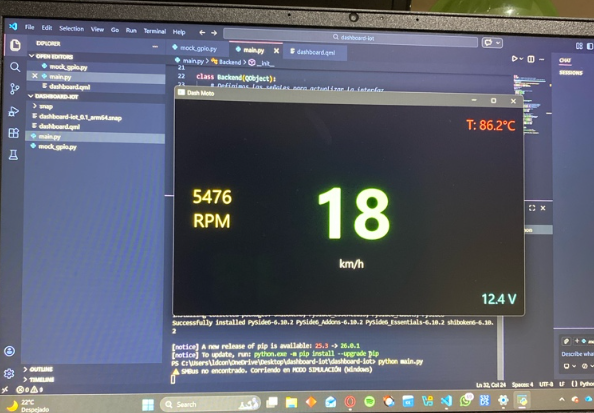

This document is about everything related with installing and running the system through the Raspberry pi 4 Model B

V 1.0:

Changes:

Changed the environment from ubuntu core to ubuntu server, this was to make easier modifying the code on the go without having to make big changes in the system, just having to change and update the code in the Raspberry.
Also made this beacuse i forgot the password i had before :( 

V 1.1:

Once having the hardware set up, (See about it in the hardware.md document) we connect everything, and start the set up process, we will be able to connect to the raspberry, send the updated codes and run them to see the changes in the external screen.

Connection process:  
    1.- Having all the hardware connected; We go to the wifi connections using "win+r" and "ncpa.cpl", there we need to right click on the wifi network we're connected, go to properties, then sahring and enable the option to allow others to connect through this pc connected network.  
    2.- On a new VSCode terminal, write "ssh ubuntu@raspberrypi.local"  
    3.- Once connected, we can run the main.py to see the dashboard 
    

