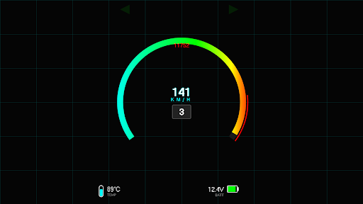
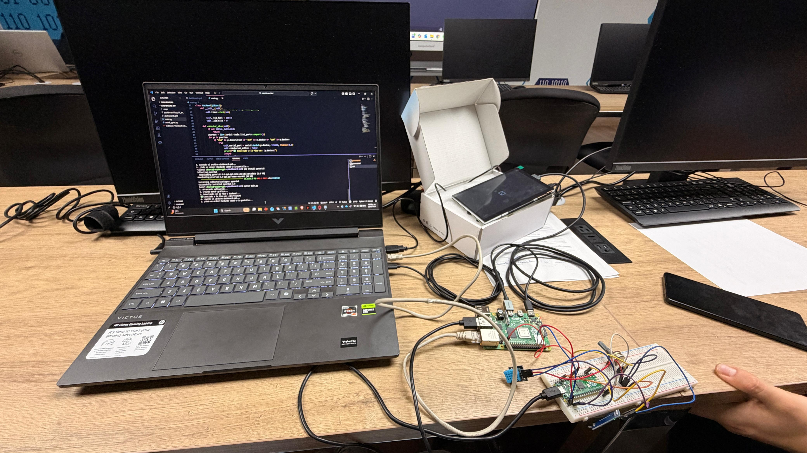

This document is about everything regarding the hardware in the project.

## V 1.1:
We already have some hardware working along qith the prevoius code, this consists of: A potenciometer, a temperature sensor, a hall sensor and an external motor.

Also, and more important, we have as the brain of the project, the only connections we have are the power usb-c cable to the raspberry and an Ethernet cable to access ubuntu from our VS Code terminal without needing an external monitor, mouse and keyboard connected to the raspberry.

Right now we do need an external screen to see the changes made in the proyect, but we have the objective to being capable of making changes and seeing them without anything connected, like a test running in VS Code, but that will be seen later.

## V 1.4 Note:
While the UI is now receiving data from the Python backend, the backend is still using placeholder data generation. The next major step is figuring out the best microcontroller communication protocol to get real sensor data from the bike into the Raspberry Pi.

## V 2.0: The Hardware Overhaul

**New Brain: Raspberry Pi Pico**
We officially moved away from the initial Arduino/I2C testing setup and introduced the Raspberry Pi Pico as the dedicated sensor-reading microcontroller. 

**Why the Pico?**
- It runs MicroPython, keeping the entire project's codebase in the Python ecosystem.
- Its 3.3V logic level matches the Raspberry Pi 4 perfectly, avoiding the need for logic level shifters.
- It's incredibly fast and has plenty of GPIOs for all the motorcycle's analog and digital signals.

**Communication: UART**
The communication protocol between the Pico and the Pi 4 was changed to UART (Serial). 
- Pico TX -> Pi 4 RX
- Pico RX -> Pi 4 TX
This proved to be much more stable and easier to debug for continuous data streaming compared to our early I2C attempts.

## V2.1: Physical Interface Integration

In this version, we transitioned from simulated UI inputs to actual physical controls, routing all signals through the Raspberry Pi Pico to centralize the telemetry:

* **Turn Signals (Direccionales):** Integrated a physical 3-position toggle switch (Left - Off - Right) wired directly to the Pico's GPIO pins. 
* **Hazard Lights (Intermitentes):** Added a dedicated push button to trigger both signals simultaneously.
* **Headlights:** Wired a push button to toggle the UI state between High Beam and Low Beam.

**Architecture Note:** All these new physical inputs utilize the Pico's internal pull-up/pull-down resistors. This allows the MicroPython script to debounce the signals before packaging them into the clean CSV string sent via UART to the main Raspberry Pi 4.

## V2.3: Hardware-in-the-Loop (HIL) Speed Simulator

To properly test the Hall effect sensor at high, sustained speeds, we built a motorized physical simulator controlled by the Raspberry Pi Pico:

* **Electronic Throttle:** Added a secondary potentiometer connected to `GP27` (ADC) to read user input.
* **PWM Motor Control:** The Pico maps the ADC throttle reading to a 1kHz PWM output on `GP16`.
* **Isolated Power Circuit:** To safely drive the high-current DC motor, the `GP16` PWM signal triggers a power transistor (acting as a switch). A flyback diode is wired in parallel with the motor to protect the Pico's logic board from inductive voltage spikes when the motor stops.